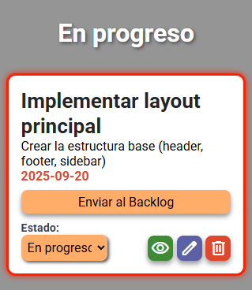

# To-Do List App
 Aplicación web para la gestión de tareas y sprints, desarrollada con React + TypeScript, Zustand para el manejo de estado y json-server como backend temporal. Permite organizar tareas y sprints de forma visual y eficiente.
 
 

## Características Principales:
* Gestión completa de tareas y sprints (CRUD)

* Backlog centralizado para tareas específicas

* Visualización de sprints en columnas

* Movimiento dinámico de tareas entre estados y entre backlog/sprint

* Filtro automático de tareas próximas a vencer (3 días) y resaltado de las mismas para advertir al usuario

## Tecnologías Utilizadas:
* React + TypeScript:	Frontend y lógica de la app
* Zustand:	Gestión de estado global
* CSS:	Estilos 
* json-server:	Backend temporal con API REST

## Cómo Ejecutar el Proyecto
bash:
* Instalar dependencias: 
**npm install**

* Ejecutar frontend: 
**npm run dev**

* Ejecutar backend temporal: 
**npx json-server --watch db.json**

## Vistas Previas de la App:
**Pantalla Backlog**

**Pantalla Principal**

**Tarea pronta a vencer:**

**Modal Crear/Editar/Ver Tarea (Mismo formato para Sprint):**

## Autores:
Maximiliano Niscola

Sofía Ferraro
